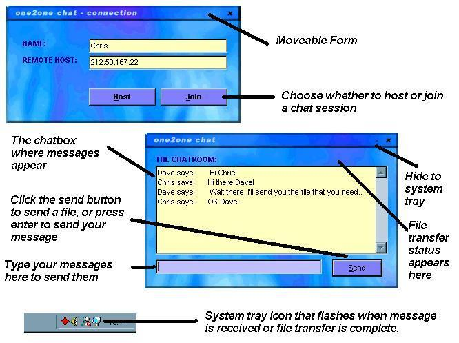



## One2One Chat & File transfer

### Description

One2One Network Chat with Winsock File Transfers

One small program that is great for chatting and sending files other a network, everything is explained on the screenshot

Demonstrates how to use lots of things and includes a few nice .bas files to use such as easy system tray usage

please vote.
 
### More Info
 

             |
---                |---
**Submitted On**   |2001-08-21 16:21:34
**By**             |[Chris Wilson UK](https://github.com/Planet-Source-Code/PSCIndex/blob/master/ByAuthor/chris-wilson-uk.md)
**Level**          |Intermediate
**User Rating**    |4.8 (24 globes from 5 users)
**Compatibility**  |VB 6\.0
**Category**       |[Complete Applications](https://github.com/Planet-Source-Code/PSCIndex/blob/master/ByCategory/complete-applications__1-27.md)
**World**          |[Visual Basic](https://github.com/Planet-Source-Code/PSCIndex/blob/master/ByWorld/visual-basic.md)
**Archive File**   |[one2one ch250408212001\.zip](https://github.com/Planet-Source-Code/chris-wilson-uk-one2one-chat-file-transfer__1-26440/archive/master.zip)

